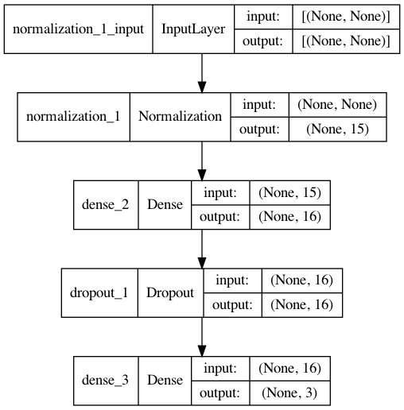

# football-predictor

## Overview
This project uses a neural network to predict the outcomes of 
English Premier League football matches based on each team's 
recent performance.

## Dataset preparation
The raw data were downloaded from http://www.football-data.co.uk.
All match results from the 2011-12 to 2021-22 seasons are
saved in `data/EPL_results_all.csv`. Premier League standings 
from 2010-2021 were downloaded from 
[Kaggle](https://www.kaggle.com/quadeer15sh/premier-league-standings-11-seasons-20102021)
and saved in `data/EPL_Standings.csv`. You can substitute your own data files as long
as they are in the same format as the ones provided.

To extract useful features from the two sets of raw data and rewrite them
in a usable format, run `dataset.py` using the following command:
```commandline
python dataset.py --standings [path to PL standings file] --raw-data [path to all match results]
--save [True or False] --save-to [path to save output]
```
Or see the beginning
of `dataset_visualize.ipynb`. 

For each match, the script
retrieves the last 5 home and away games each team has played
and averages certain statistics to use as features. The 
results are then saved in `data/EPL_processed_results.csv`.
Here are the available columns to use as features in training:

```commandline
'StandingDiff': difference between the home and away teams' standings from last season
'HomeWins': home team's percentage of wins in last 5 home games
'AwayWins': away team's percentage of wins in last 5 away games
'HomeDraws': home team's percentage of draws in last 5 home games
'AwayDraws': away team's percentage of draws in last 5 away games
'AvgHomeGoals': home team's average # of goals scored in the last 5 home matches
'AvgAwayGoals': away team's average # of goals scored in the last 5 away matches
'AvgHomeShots': home team's average # of shots in the last 5 home matches
'AvgAwayShots': away team's average # of shots in the last 5 away matches 
'AvgHomeShotsOnTarget': home team's average # of shots on target in the last 5 home matches 
'AvgAwayShotsOnTarget': away team's average # of shots on target in the last 5 away matches
'AvgHomeGoalsConceded': home team's average # of goals conceded in the last 5 home matches 
'AvgAwayGoalsConceded': away team's average # of goals conceded in the last 5 away matches 
'AvgHomeShotsConceded': home team's average # of shots on target in the last 5 home matches 
'AvgAwayShotsConceded': away team's average # of shots on target in the last 5 away matches 
```
Among the remaining columns, `HomeGoals` and `AwayGoals` show
the number of goals scored by the home and away teams in 
the given match, and `FTR` is the final result (home win `H`,
draw `D` or away win `A`).

The average numbers of corners taken by each team in the last 5 home and away matches 
are also available in the dataset, but have been excluded from the model because 
experimentation shows that these features do not improve the model's performance.

Before training the model, we need to split the dataset into train, validation and test 
sets using `dataset.generate_train_val_test_sets`. The last available season is 
always set aside as the test set, and the preceding seasons are shuffled and split 
into train and validation sets (by default 80% train and 20% validation).

## Model training
All functionalities related to training and predictions are found in `predict.py`.
You can find a demonstration of the training steps in the notebook `train_model.ipynb`.

The model is a multiclass classifier and has the following architecture:


The output is three numbers corresponding to the probabilities of a home win, draw,
and away win respectively.
You can train a new model from scratch following the steps in 
`train_model.ipynb` or load a saved model with `Predictor.load_saved_model`.
If a new model is trained, `Predictor.train_model` will train the model 
for a maximum of 100 epochs, with early stopping if the validation loss stops decreasing.

## Evaluating on the test set and predicting on new data
These two steps are shown in the notebook `evaluate_and_predict.ipynb`.

To evaluate a trained model on a test set, initialize a `Predictor` object and 
call the following function after training or loading the model:

```python
loss, acc = predictor.evaluate(X_test, y_test)
```
which returns the test loss and accuracy.

To make a prediction on a single sample, the sample must be in pandas dataframe format 
and have the same columns as the train/val/test data (see [Dataset preparation](#dataset-preparation) for a 
list of required columns). `Predict.predict` returns the predicted 
win/draw/loss probabilities for the given match.